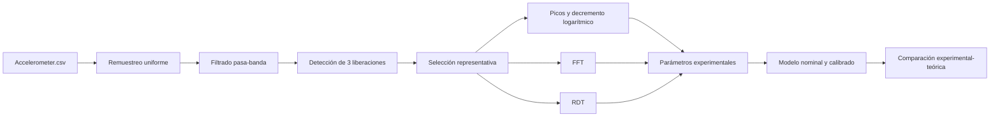

# Modelado Dinámico Experimental

Repositorio académico para el análisis experimental y modelado computacional de
sistemas dinámicos mediante ecuaciones diferenciales, sensores móviles y
Python.

El proyecto está diseñado para incorporar progresivamente nuevos experimentos.
El primer estudio implementado corresponde a la identificación de parámetros
dinámicos de una viga metálica en voladizo instrumentada con el acelerómetro de
un teléfono inteligente.

## Experimento actual

El sistema físico se aproxima mediante un modelo de un grado de libertad
(SDOF). Una escuadra metálica de acero fue fijada como viga en voladizo y un
teléfono móvil fue colocado en el extremo libre para actuar simultáneamente como
masa adicional y sensor.

Se realizaron ensayos de vibración libre para desplazamientos iniciales de:

```text
1.0 cm, 1.5 cm, 2.0 cm, 2.5 cm y 3.0 cm
```

Cada registro contiene tres liberaciones sucesivas. El programa detecta estas
liberaciones, selecciona una respuesta representativa y calcula los parámetros
dinámicos del sistema.

## Funcionalidades

- Lectura de registros acelerométricos en formato CSV.
- Corrección del muestreo temporal irregular.
- Filtrado digital pasa-banda.
- Detección automática de liberaciones.
- Selección reproducible de una liberación representativa.
- Identificación de picos positivos.
- Cálculo de periodo y frecuencia amortiguada.
- Estimación del amortiguamiento mediante decremento logarítmico.
- Análisis espectral mediante FFT.
- Aplicación de Random Decrement Technique (RDT).
- Modelado físico nominal de una viga en voladizo.
- Calibración de un parámetro equivalente del modelo.
- Comparación entre respuestas experimentales y teóricas.
- Generación automática de gráficas, tablas y datos procesados.

## Resultados principales

Los resultados preliminares del experimento actual son:

| Parámetro | Resultado |
| --- | ---: |
| Frecuencia promedio mediante picos | 7.235 Hz |
| Frecuencia promedio mediante FFT | 7.246 Hz |
| Diferencia entre métodos | 0.144% |
| Relación de amortiguamiento promedio | 0.372% |
| Frecuencia del modelo nominal | 14.216 Hz |
| Espesor equivalente del modelo calibrado | 1.257 mm |

La frecuencia identificada permaneció prácticamente constante frente al aumento
del desplazamiento inicial, lo que respalda el comportamiento aproximadamente
lineal del sistema dentro del intervalo ensayado.

## Estructura del repositorio

```text
modelado-dinamico-experimental/
├── analysis/
│   ├── config.py
│   ├── signal_processing.py
│   ├── modeling.py
│   ├── analyze_experiments.py
│   ├── README.md
│   └── EXPLICACION_DEL_CODIGO.md
├── results/
│   ├── figures/
│   ├── tables/
│   ├── processed_data/
│   └── README.md
├── data/
│   ├── evidencias_fotogramas/
│   ├── sensor/
├── requirements.txt
└── README.md
```

### Módulos principales

- `analysis/config.py`: rutas, ensayos, parámetros metodológicos y propiedades
  físicas.
- `analysis/signal_processing.py`: remuestreo, filtrado, picos, FFT, RDT y
  selección de liberaciones.
- `analysis/modeling.py`: modelo físico nominal, calibración y respuesta
  teórica.
- `analysis/analyze_experiments.py`: ejecución completa del procesamiento.
- `analysis/EXPLICACION_DEL_CODIGO.md`: explicación técnica detallada.

## Instalación

Se recomienda utilizar Python 3.11 o superior.

Desde PowerShell, en la raíz del repositorio:

```powershell
python -m venv .venv
.\.venv\Scripts\Activate.ps1
python -m pip install -r requirements.txt
```

## Datos experimentales

Los datos crudos, videos, conversaciones y evidencias se mantienen fuera del
control de versiones por privacidad y tamaño.

Por defecto, el programa busca los sensores en:

```text
data/sensor
```

Esta carpeta debe contener:

```text
data/sensor/
├── 1cm-2026-05-28_19-22-54/
├── 1_5cm-2026-05-28_19-28-28/
├── 2cm-2026-05-28_19-39-25/
├── 2_5cm-2026-05-28_19-44-02/
└── 3cm-2026-05-28_20-11-58/
```

Cada carpeta debe incluir su archivo `Accelerometer.csv`.

La carpeta indicada debe contener directamente las carpetas experimentales.

## Ejecución

Para analizar todos los ensayos:

```powershell
.\.venv\Scripts\python.exe -m analysis.analyze_experiments
```

Los resultados se generan dentro de:

```text
results/
├── figures/
├── tables/
└── processed_data/
```

Los archivos originales nunca son modificados.

## Metodología resumida



## Reproducibilidad

Los valores experimentales y metodológicos se encuentran centralizados en
`analysis/config.py`. Al modificar una medida o criterio y ejecutar nuevamente
el programa, todas las tablas y figuras se regeneran utilizando la nueva
configuración.

El modelo conserva dos interpretaciones:

- **Modelo nominal:** utiliza el espesor estimado físicamente de 2 mm.
- **Modelo calibrado:** utiliza un espesor equivalente de 1.257 mm para
  reproducir la frecuencia experimental.

El espesor calibrado no se presenta como una medición directa, sino como un
parámetro equivalente que representa también efectos no modelados.

## Incorporación de futuros experimentos

Los nuevos temas deben mantener la separación entre:

```text
código reproducible -> analysis/
resultados derivados -> results/
datos privados o pesados -> data/ o almacenamiento externo
```

Cuando un nuevo experimento requiera un procesamiento diferente, se recomienda
crear un submódulo específico dentro de `analysis` y una carpeta correspondiente
dentro de `results`.
